# Process Overview - Quick Visual Guide

**For**: New team members and quick reference

> **Need details?** See [AI-Assisted Agile Process](ai-assisted-agile-process.md) for complete documentation.

---

## 📊 Complete Process Flow

```mermaid
flowchart TB
    PRD[📄 Product Requirement<br/>Document]
    TechSpec[🏗️ Technical Specification<br/>Architecture & Design Decisions]
    ProductBacklog[📚 Product Backlog<br/>Features & User Stories]

    SprintPlanning[📋 Sprint Planning<br/>AI-Assisted Task Breakdown]
    SprintBacklog[✅ Sprint Backlog<br/>Prioritized Technical Tasks]

    subgraph ParallelDev[🔄 Parallel Development]
        direction TB
        Planning[☁️ Claude Cloud<br/>Design & Architecture]
        Implementation[💻 Claude Code CLI<br/>Code Implementation]
        Planning -.Design Context.-> Implementation
    end

    CodeReview[🔍 AI Code Review<br/>+ Human Review]
    Testing[🧪 Automated Testing<br/>+ Manual QA]
    Integration[🔀 Continuous Integration<br/>Daily Rebase & Merge]

    FinishedWork[✨ Finished Work<br/>Code + Tests + Docs]
    SprintReview[📊 Sprint Review &<br/>Retrospective]

    DecisionLog[(📖 Decision Log<br/>Patterns & Trade-offs)]

    PRD --> TechSpec
    TechSpec --> ProductBacklog
    ProductBacklog --> SprintPlanning
    SprintPlanning --> SprintBacklog
    SprintBacklog --> ParallelDev
    ParallelDev --> CodeReview
    CodeReview --> Testing
    Testing --> Integration
    Integration --> FinishedWork
    FinishedWork --> SprintReview
    SprintReview --> ProductBacklog

    TechSpec -.Context.-> DecisionLog
    SprintReview -.Learnings.-> DecisionLog
    DecisionLog -.Context.-> Planning
    DecisionLog -.Context.-> Implementation

    style ParallelDev fill:#e8f4f8
    style Planning fill:#fff4e1
    style Implementation fill:#e1f5ff
    style DecisionLog fill:#f0f0f0
    style TechSpec fill:#e8ffe8
```

---

## 🎯 Two-Tool System

| Tool | Purpose | Use For |
|------|---------|---------|
| **☁️ Claude Cloud** | Design & Planning | Sprint planning, architecture, complex problem solving |
| **💻 Claude Code CLI** | Implementation | Coding, tests, git operations, debugging |

**Flow**: Design in Cloud → Document → Implement in CLI → Update [start-here.md](../start-here.md)

---

## 📅 Daily Workflow

```mermaid
flowchart LR
    subgraph Morning["🌅 Morning (8-10 AM): Rebase Window"]
        Fetch[Fetch Master]
        Rebase[Rebase Branch]
        Test1[Run Tests]
        Push[Force Push]
    end

    subgraph Midday["☀️ Midday (10 AM-4 PM): Development"]
        Design[☁️ Claude Cloud<br/>Design Session]
        Code[💻 Claude Code CLI<br/>Implementation]
        Review[Self Review]
    end

    subgraph Afternoon["🌤️ Afternoon (4-5 PM): Review Window"]
        CreatePR[Create/Update PR]
        AIReview[AI Code Review]
        Checklist[Pre-Merge Checklist]
    end

    subgraph Evening["🌆 Evening (5-6 PM): Merge Window"]
        Priority[Sort by Priority]
        Merge[Merge to Master]
        Test2[Run Full Tests]
        Notify[Notify Team]
    end

    Fetch --> Rebase --> Test1 --> Push
    Push --> Design --> Code --> Review
    Review --> CreatePR --> AIReview --> Checklist
    Checklist --> Priority --> Merge --> Test2 --> Notify

    style Morning fill:#fff4e1
    style Midday fill:#e1f5ff
    style Afternoon fill:#e8ffe8
    style Evening fill:#ffe8e8
```

---

## 🎨 Three Rules for Zero Conflicts

1. **One Feature = One Module** → No conflicts
2. **Shared Files = Different Sections** → Clean merges
3. **Same Function = Serialize Development** → Coordinate timing

---

## 🏗️ Shared File Patterns (Quick Reference)

See [Parallel Development Best Practices](parallel-sprint-development-best-practices.md) for details.

- **Config files**: Section-based (comment headers)
- **Entry points**: Registration pattern (append)
- **Validators**: Pipeline pattern (stages)

---

## 🔀 Merge Priorities

| Priority | Type | Action |
|----------|------|--------|
| P1 | Isolated module | Merge first |
| P2 | Shared files, different sections | Merge same cycle |
| P3 | Depends on P1/P2 | Rebase then merge |
| P4 | Depends on P3 | Rebase then merge |

---

## ✅ Pre-Merge Checklist (Quick)

1. ✅ Rebased on master
2. ✅ Linter passing (0 errors)
3. ✅ All tests passing
4. ✅ Coverage ≥80%
5. ✅ Module isolation maintained
6. ✅ Docs updated

---

## 📚 Documentation Map

| Document | Purpose |
|----------|---------|
| **This document** | Visual overview & quick start |
| [When to Use Parallel Dev](WHEN-TO-USE-PARALLEL-DEVELOPMENT.md) | Decision matrix - Sequential vs Parallel |
| [AI-Assisted Agile Process](ai-assisted-agile-process.md) | Complete detailed workflow |
| [Parallel Dev Best Practices](parallel-sprint-development-best-practices.md) | Conflict prevention strategies |
| [Quick Reference](quick-reference.md) | Commands & common patterns |
| [start-here.md](../start-here.md) | Current sprint context |
| [CLAUDE.md](../CLAUDE.md) | Claude Code instructions |

---

## 💡 Core Principles (20% that delivers 80%)

1. **Module Isolation** - One feature = One module
2. **Daily Rebase** - Prevent big conflicts
3. **Use Patterns** - For shared files
4. **Right Tool** - Design in Cloud, code in CLI
5. **Update [start-here.md](../start-here.md)** - Every session

---

**Version**: 3.0 (Simplified)
**For details**: See [AI-Assisted Agile Process](ai-assisted-agile-process.md)
