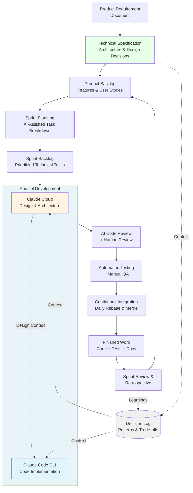
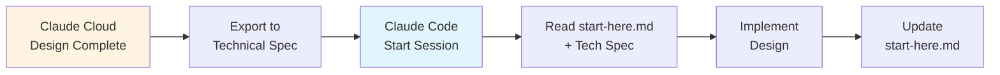

# AI-Assisted Agile Development Process

**Document Type**: Optimized Development Process
**Version**: 3.0
**Tools**: Claude Cloud (Projects) + Claude Code CLI
**Methodology**: Agile/Scrum with Parallel Development

---

## Process Overview



---

## Phase 1: Product Requirements & Technical Specification

### 1.1 Product Requirement Document (PRD)
**Owner**: Product Manager
**Tool**: Claude Cloud (for refinement)

**Contents**:
- Business objectives
- User stories with acceptance criteria
- Success metrics
- Constraints and assumptions

**🎯 Template**: `templates/prd-template.md`

### 1.2 Technical Specification
**Owner**: Tech Lead + Claude Cloud
**Tool**: Claude Cloud for architecture planning

**Activities**:
- Review PRD and translate to technical requirements
- Define system architecture and component design
- Select tech stack and frameworks
- Identify integration points and dependencies
- Document coding patterns and conventions
- Define API contracts and data schemas

**Outputs**:
- Architecture diagrams
- Tech stack decisions
- Coding standards
- API specifications
- Database schema

**🎯 Template**: `templates/technical-spec-template.md`

---

## Phase 2: Sprint Planning

### 2.1 Backlog Refinement
**Tool**: Claude Cloud

**Process**:
1. Review technical specification
2. Break features into user stories
3. Estimate complexity and effort
4. Identify dependencies between stories
5. Create product backlog with priorities

### 2.2 Sprint Planning Meeting
**Tool**: Claude Cloud + Team

**Activities**:
1. Select stories for sprint based on capacity
2. Break stories into technical tasks
3. Assign tasks to isolated modules (conflict prevention)
4. Identify high-risk shared files
5. Establish merge priorities (P1/P2/P3/P4)
6. Set up parallel development branches

**Outputs**:
- Sprint backlog with task assignments
- Branch strategy and naming
- Module isolation plan
- Daily workflow schedule

**🎯 Template**: `templates/sprint-planning-template.md`

---

## Phase 3: Parallel Development Workflow

### 3.1 Branch Structure

**Naming Convention**:
```
feature/<ticket-id>-<short-description>
bugfix/<ticket-id>-<short-description>
hotfix/<ticket-id>-<short-description>
```

**Lifecycle**:
1. Create from latest master
2. Develop single feature only
3. Rebase daily on master
4. Merge after approval
5. Delete after merge

### 3.2 Module Isolation Strategy

**Assignment Rules**:

**Rule 1**: One feature per isolated module = Zero conflicts
```
Feature A → src/module_a/ only
Feature B → src/module_b/ only
```

**Rule 2**: Multiple features in shared files = Different sections
```
Feature A → src/shared/config.py (section 1)
Feature B → src/shared/config.py (section 2)
```

**Rule 3**: Same function modifications = Serialize development
```
Feature A → src/utils/validator.py validate()
Feature B waits for Feature A merge
```

**High-Risk Files** (document in sprint planning):
- Configuration files
- Application entry points
- Shared utilities
- Test fixtures

### 3.3 Daily Development Workflow

```mermaid
flowchart LR
    subgraph Morning["Morning (8-10 AM): Rebase Window"]
        Fetch[Fetch Master]
        Rebase[Rebase Branch]
        Test1[Run Tests]
        Push[Force Push]
    end

    subgraph Midday["Midday (10 AM-4 PM): Development"]
        Design[Claude Cloud<br/>Design Session]
        Code[Claude Code CLI<br/>Implementation]
        Review[Self Review]
    end

    subgraph Afternoon["Afternoon (4-5 PM): Review Window"]
        CreatePR[Create/Update PR]
        AIReview[AI Code Review]
        Checklist[Pre-Merge Checklist]
    end

    subgraph Evening["Evening (5-6 PM): Merge Window"]
        Priority[Sort by Priority]
        Merge[Merge to Master]
        Test2[Run Full Tests]
        Notify[Notify Team]
    end

    Fetch --> Rebase --> Test1 --> Push
    Push --> Design --> Code --> Review
    Review --> CreatePR --> AIReview --> Checklist
    Checklist --> Priority --> Merge --> Test2 --> Notify

    style Morning fill:#fff4e1
    style Midday fill:#e1f5ff
    style Afternoon fill:#e8ffe8
    style Evening fill:#ffe8e8
```



**No merges during rebase window** - ensures stable rebase target

---

## Phase 4: AI Tool Usage

### 4.1 Claude Cloud (Projects) - Design & Planning

**Use Cases**:
- Initial feature architecture and design
- Complex problem-solving discussions
- API contract and schema design
- Cross-feature impact analysis
- Design pattern selection
- Code review strategy planning
- Sprint retrospective analysis

**Best Practices**:
- Keep conversation context focused on design
- Document decisions in Decision Log
- Share architecture diagrams with team
- Export key decisions to technical spec

### 4.2 Claude Code CLI - Implementation

**Use Cases**:
- Writing and editing code files
- Running tests and builds
- Git operations (commit, rebase, push)
- Debugging and fixing issues
- Local development workflow
- Pre-merge checklist execution
- Automated code reviews

**Session Management**:
- Use `start-here.md` to maintain context
- Update progress after each session
- Document blockers and dependencies
- Track files modified

**🎯 Template**: `start-here.md`

### 4.3 Coordination Between Tools



---

## Phase 5: Code Review & Testing

### 5.1 AI-Assisted Code Review

**Tool**: Claude Code CLI

**Checklist**:
- [ ] Code follows project conventions
- [ ] No security vulnerabilities (OWASP Top 10)
- [ ] Proper error handling
- [ ] No code duplication
- [ ] Functions are focused and small
- [ ] Meaningful variable names
- [ ] Adequate test coverage

### 5.2 Pre-Merge Checklist

**Required before creating PR**:

**1. Rebase on Master**
```bash
git fetch origin master
git rebase origin/master
```

**2. Code Quality**
```bash
<linter-command>         # Zero errors
<formatter-command>      # Code formatted
<type-checker-command>   # Type safety
```

**3. Test Coverage**
```bash
<test-command>              # All tests pass
<coverage-command>          # ≥80% coverage
```

**4. Manual Testing**
- Test on real scenarios
- Verify acceptance criteria
- Check integration points

**🎯 Template**: `templates/pr-checklist.md`

### 5.3 Pull Request Creation

**PR Description Template**:
```markdown
## Ticket
[TICKET-123] Feature description

## Changes
- Change 1
- Change 2

## Files Modified
- src/module/file1.py
- tests/test_file.py

## Testing
- [ ] Unit tests added
- [ ] Integration tests added
- [ ] Manual testing completed

## Priority
[P1/P2/P3/P4]

## Potential Conflicts
[List high-risk files touched or "None"]
```

**🎯 Template**: `templates/pr-template.md`

---

## Phase 6: Merge Priority System

### P1: Zero Dependencies
- Isolated module changes only
- No shared file modifications
- **Merge first**

### P2: Parallel Tracks
- Shared files, different sections
- No functional dependencies
- **Merge same cycle as P1**

### P3: Depends on P1/P2
- Uses P1/P2 functionality
- **Rebase after P1/P2, then merge**

### P4: Depends on P3
- Uses P3 functionality
- **Rebase after P3, then merge**

---

## Phase 7: Continuous Integration

### 7.1 Daily Rebase (Morning)

**All Development Branches**:
```bash
git fetch origin master
git rebase origin/master
git push origin <branch> --force-with-lease
<run-tests>
```

### 7.2 Merge Execution (Evening)

**Merge Master Process**:
```bash
# For each PR in priority order:
git checkout master && git pull origin master
git merge --no-ff origin/<branch>
<run-full-test-suite>
git push origin master
git push origin --delete <branch>
```

**Rollback on failure**:
```bash
git reset --hard HEAD~1
git push origin master --force-with-lease
# Notify developer of test failures
```

---

## Phase 8: Sprint Review & Retrospective

### 8.1 Sprint Review
**Tool**: Claude Cloud

**Activities**:
- Demo completed features
- Review against acceptance criteria
- Gather stakeholder feedback
- Document incomplete items

### 8.2 Retrospective
**Tool**: Claude Cloud for analysis

**Review**:
- What went well
- What didn't go well
- Success metrics analysis
- Process improvements

**Metrics to Track**:
- Features merged / Features planned
- Conflict rate (<10% target)
- Average resolution time (<30 min target)
- Test pass rate (100% target)
- Code coverage (≥80% target)

### 8.3 Decision Log Update

**Document**:
- Architecture decisions made
- Patterns that worked well
- Patterns that caused issues
- Dependencies discovered
- Technical debt created

**🎯 Template**: `templates/decision-log-template.md`

---

## Shared File Conflict Prevention Patterns

### Pattern 1: Configuration Files
```python
class Config:
    # === Feature A (PROJ-123) ===
    def get_feature_a_setting(self):
        return self.get('feature_a.setting', default)

    # === Feature B (PROJ-456) ===
    def get_feature_b_setting(self):
        return self.get('feature_b.setting', default)
```

### Pattern 2: Entry Point Files
```python
def main():
    existing_logic()
    register_feature_a()  # Feature A
    register_feature_b()  # Feature B
```

### Pattern 3: Validation Pipelines
```python
def validate(self, data):
    # Feature A: Pre-validation
    if not self._pre_check(data):
        return ValidationError()

    # Existing (untouched)
    if not self._existing(data):
        return ValidationError()

    # Feature B: Post-validation
    if not self._post_check(data):
        return ValidationError()
```

### Pattern 4: Test Fixtures
```
tests/
├── conftest.py              # Shared only
├── fixtures_feature_a.py    # Feature A
└── fixtures_feature_b.py    # Feature B
```

---

## Conflict Resolution Process

### Resolution Steps
```bash
# 1. Identify
git status
git diff

# 2. Determine type
# - Different sections: Keep both
# - Same section: Coordinate with other developer

# 3. Resolve
<edit-conflicted-files>

# 4. Test
git add <resolved-files>
git rebase --continue
<run-tests>
```

### Common Types

**Type 1: Different Sections** (Keep both)
```python
<<<<<<< HEAD
def method_a(self): pass
=======
def method_b(self): pass
>>>>>>> branch

# Resolution:
def method_a(self): pass
def method_b(self): pass
```

**Type 2: Imports** (Merge and sort)
```python
from module import A, B, C
```

**Type 3: Same Section** (Coordinate)
```python
# Discuss with other developer
# Determine correct approach
```

---

## Template Artifacts Summary

The following templates should be created and maintained:

### 🎯 Sprint Level Templates
1. **PRD Template** (`templates/prd-template.md`)
   - Product requirements structure
   - User story format
   - Acceptance criteria guidelines

2. **Technical Spec Template** (`templates/technical-spec-template.md`)
   - Architecture documentation
   - API specifications
   - Design decisions

3. **Sprint Planning Template** (`templates/sprint-planning-template.md`)
   - Sprint goals
   - Task breakdown
   - Module assignment plan

### 🎯 Development Templates
4. **Session Context** (`start-here.md`)
   - Current branch status
   - Progress tracking
   - Next actions

5. **PR Checklist** (`templates/pr-checklist.md`)
   - Pre-merge requirements
   - Testing verification
   - Code quality checks

6. **PR Description** (`templates/pr-template.md`)
   - Standard PR format
   - Required information
   - Review guidelines

### 🎯 Documentation Templates
7. **Decision Log** (`templates/decision-log-template.md`)
   - Architecture decisions
   - Pattern documentation
   - Trade-off analysis

8. **Sprint Retrospective** (`templates/retrospective-template.md`)
   - Metrics review
   - Process improvements
   - Action items

---

## When This Process Works

### ✅ Ideal Conditions
- Clear module boundaries
- Independent features
- Team can rebase daily
- Fast test suite (<10 min)
- Quick code review turnaround
- Multiple parallel development streams

### ❌ Not Recommended
- Tight feature coupling
- Long-running branches (>1 week)
- Slow test suite (>30 min)
- Complex cross-feature coordination
- Single developer projects

---

## Prerequisites

### Repository Setup
- Git with protected master/main branch
- Test suite with fast execution (<10 min)
- Linting/formatting tools configured
- Branch naming convention
- CI/CD pipeline configured

### Team Readiness
- Understanding of rebase workflows
- Commitment to daily sync windows
- Clear communication channels
- Access to Claude Cloud and Claude Code

---

**End of Document**
