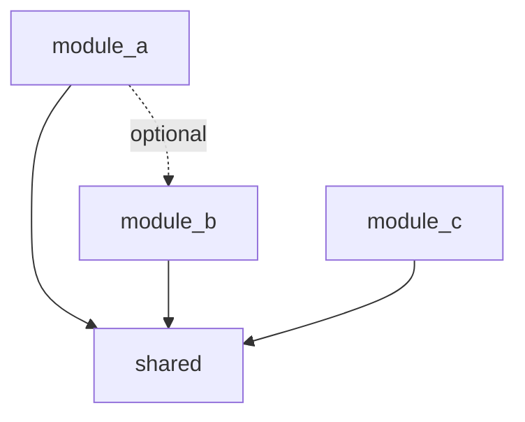
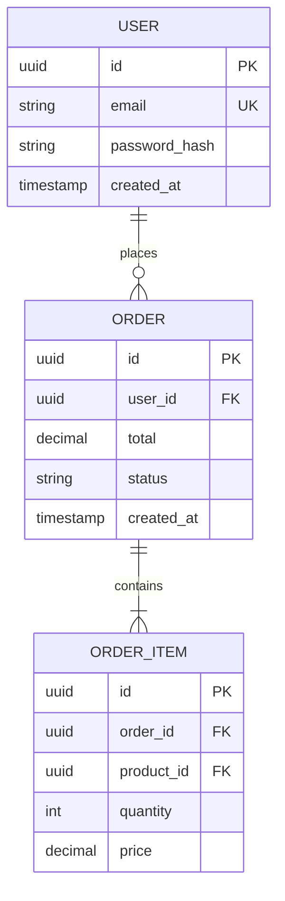

# Technical Specification

**Project**: [Project Name]
**Version**: 1.0
**Date**: [YYYY-MM-DD]
**Owner**: [Tech Lead Name]
**Status**: [Draft / Review / Approved]
**Related PRD**: [Link to PRD]

---

## Executive Summary

[2-3 sentence technical overview of the solution architecture]

---

## Technical Requirements

### Functional Requirements
Derived from PRD:
1. [Technical requirement 1 based on user story]
2. [Technical requirement 2 based on user story]
3. [Technical requirement 3 based on user story]

### Non-Functional Requirements
- **Performance**: [Specific technical targets]
- **Scalability**: [Technical approach]
- **Security**: [Security architecture]
- **Reliability**: [Uptime and recovery]
- **Maintainability**: [Code quality standards]

---

## System Architecture

### High-Level Architecture

```
[Insert architecture diagram]

Example structure:
┌─────────────┐     ┌─────────────┐     ┌─────────────┐
│   Frontend  │────▶│   API Layer │────▶│  Database   │
│   (React)   │     │   (Node.js) │     │ (PostgreSQL)│
└─────────────┘     └─────────────┘     └─────────────┘
                           │
                           ▼
                    ┌─────────────┐
                    │   Cache     │
                    │   (Redis)   │
                    └─────────────┘
```

### Component Diagram

```
[Detailed component relationships]
```

### Data Flow

```
User Request → Load Balancer → API Gateway → Service Layer → Data Layer
                                    │
                                    ├─→ Authentication Service
                                    ├─→ Business Logic Service
                                    └─→ External API Integration
```

---

## Technology Stack

### Frontend
- **Framework**: [React 18.x / Vue 3.x / Angular 15.x]
- **Language**: [TypeScript 5.x]
- **State Management**: [Redux / Zustand / Pinia]
- **UI Library**: [Material-UI / Tailwind / etc]
- **Build Tool**: [Vite / Webpack]

### Backend
- **Framework**: [Express.js / FastAPI / Spring Boot]
- **Language**: [Node.js 20.x / Python 3.11 / Java 17]
- **API Type**: [REST / GraphQL / gRPC]
- **Authentication**: [JWT / OAuth 2.0]

### Database
- **Primary Database**: [PostgreSQL 15 / MongoDB 6]
- **Cache**: [Redis 7.x]
- **Search**: [Elasticsearch 8.x] (if applicable)
- **Message Queue**: [RabbitMQ / Kafka] (if applicable)

### Infrastructure
- **Cloud Provider**: [AWS / Azure / GCP]
- **Container**: [Docker]
- **Orchestration**: [Kubernetes / ECS]
- **CI/CD**: [GitHub Actions / Jenkins / GitLab CI]
- **Monitoring**: [Prometheus + Grafana / Datadog]
- **Logging**: [ELK Stack / CloudWatch]

### Development Tools
- **Version Control**: Git + [GitHub / GitLab / Bitbucket]
- **Code Quality**: [ESLint / Pylint] + [Prettier / Black]
- **Testing**: [Jest / Pytest] + [Cypress / Playwright]
- **Documentation**: [JSDoc / Sphinx]

---

## Module Design

### Module Structure

```
project-root/
├── src/
│   ├── module_a/           # Feature A (isolated)
│   │   ├── __init__.py
│   │   ├── handlers.py
│   │   ├── models.py
│   │   ├── services.py
│   │   └── validators.py
│   ├── module_b/           # Feature B (isolated)
│   ├── shared/             # Shared utilities
│   │   ├── config.py       # HIGH-RISK: Multiple features
│   │   ├── utils.py
│   │   └── validators.py   # HIGH-RISK: Multiple features
│   └── main.py             # HIGH-RISK: Entry point
├── tests/
│   ├── test_module_a/
│   ├── test_module_b/
│   └── fixtures/
├── config/
│   ├── development.yaml
│   ├── production.yaml
│   └── test.yaml
└── docs/
```

### Module Dependencies



### High-Risk Files (Shared Across Features)

| File Path | Purpose | Risk Level | Mitigation |
|-----------|---------|------------|------------|
| src/shared/config.py | Configuration | High | Use section-based patterns |
| src/main.py | Entry point | High | Use registration pattern |
| src/shared/validators.py | Validation | Medium | Pipeline pattern |
| tests/conftest.py | Test fixtures | Medium | Feature-specific fixtures |

---

## API Design

### RESTful Endpoints

#### Feature A Endpoints
```
POST   /api/v1/resource          Create resource
GET    /api/v1/resource/:id      Get resource
PUT    /api/v1/resource/:id      Update resource
DELETE /api/v1/resource/:id      Delete resource
GET    /api/v1/resources         List resources
```

#### Request/Response Examples

**POST /api/v1/resource**
```json
Request:
{
  "name": "Example",
  "type": "TypeA",
  "config": {
    "key": "value"
  }
}

Response: 201 Created
{
  "id": "uuid-here",
  "name": "Example",
  "type": "TypeA",
  "config": {
    "key": "value"
  },
  "created_at": "2025-01-15T10:00:00Z"
}
```

### API Authentication

**Method**: JWT Bearer Token

```
Authorization: Bearer <token>
```

**Token Structure**:
```json
{
  "sub": "user-id",
  "role": "admin",
  "exp": 1737200000
}
```

---

## Database Schema

### Entity Relationship Diagram



### Table Definitions

#### users
```sql
CREATE TABLE users (
    id UUID PRIMARY KEY DEFAULT gen_random_uuid(),
    email VARCHAR(255) UNIQUE NOT NULL,
    password_hash VARCHAR(255) NOT NULL,
    first_name VARCHAR(100),
    last_name VARCHAR(100),
    role VARCHAR(50) DEFAULT 'user',
    is_active BOOLEAN DEFAULT true,
    created_at TIMESTAMP DEFAULT CURRENT_TIMESTAMP,
    updated_at TIMESTAMP DEFAULT CURRENT_TIMESTAMP
);

CREATE INDEX idx_users_email ON users(email);
CREATE INDEX idx_users_active ON users(is_active);
```

### Data Migration Strategy

**Phase 1**: Schema creation
**Phase 2**: Reference data population
**Phase 3**: Historical data migration (if applicable)
**Phase 4**: Validation and testing

---

## Coding Standards & Patterns

### Design Patterns

1. **Repository Pattern**: Data access layer
2. **Service Layer Pattern**: Business logic isolation
3. **Factory Pattern**: Object creation
4. **Strategy Pattern**: Algorithm selection

### Code Organization

```python
# Good: Clear separation of concerns
class UserService:
    def __init__(self, repository: UserRepository):
        self.repository = repository

    def create_user(self, data: UserCreate) -> User:
        # Validate
        self._validate_user_data(data)
        # Create
        user = self.repository.create(data)
        # Post-process
        self._send_welcome_email(user)
        return user
```

### Naming Conventions

- **Variables**: snake_case (Python) / camelCase (JavaScript)
- **Functions**: snake_case (Python) / camelCase (JavaScript)
- **Classes**: PascalCase
- **Constants**: UPPER_SNAKE_CASE
- **Files**: snake_case.py / kebab-case.js
- **Modules**: snake_case

### Error Handling

```python
# Standard error response format
{
    "error": {
        "code": "VALIDATION_ERROR",
        "message": "User-friendly message",
        "details": {
            "field": "email",
            "reason": "Invalid format"
        },
        "timestamp": "2025-01-15T10:00:00Z",
        "request_id": "uuid-here"
    }
}
```

### Logging Standards

```python
# Structured logging
logger.info(
    "User created",
    extra={
        "user_id": user.id,
        "email": user.email,
        "source": "api",
        "duration_ms": 45
    }
)
```

---

## Security Architecture

### Authentication Flow

```
1. User submits credentials
2. Server validates against database
3. Server generates JWT token
4. Client stores token (httpOnly cookie)
5. Client sends token with each request
6. Server validates token and extracts user context
```

### Authorization

**Role-Based Access Control (RBAC)**:
- **Admin**: Full access
- **Manager**: Read/write specific resources
- **User**: Read own resources only

### Security Measures

- [ ] Input validation and sanitization
- [ ] SQL injection prevention (parameterized queries)
- [ ] XSS prevention (content security policy)
- [ ] CSRF protection (tokens)
- [ ] Rate limiting (100 req/min per IP)
- [ ] Password hashing (bcrypt, cost=12)
- [ ] HTTPS only (TLS 1.3)
- [ ] Security headers (HSTS, X-Frame-Options, etc)

---

## Testing Strategy

### Test Pyramid

```
        ┌─────────────┐
        │     E2E     │  10%
        │   (Cypress) │
        ├─────────────┤
        │ Integration │  30%
        │   (API)     │
        ├─────────────┤
        │    Unit     │  60%
        │   (Jest)    │
        └─────────────┘
```

### Test Coverage Requirements

- **Overall**: ≥80%
- **Critical paths**: ≥95%
- **New code**: ≥80%

### Testing Tools

- **Unit**: Jest / Pytest
- **Integration**: Supertest / TestClient
- **E2E**: Cypress / Playwright
- **Performance**: k6 / JMeter
- **Security**: OWASP ZAP / Burp Suite

---

## Performance Requirements

### Response Time Targets

| Endpoint | p50 | p95 | p99 |
|----------|-----|-----|-----|
| GET /api/v1/resource | <100ms | <200ms | <500ms |
| POST /api/v1/resource | <200ms | <400ms | <1s |
| Complex queries | <500ms | <1s | <2s |

### Caching Strategy

- **Browser cache**: Static assets (1 year)
- **CDN cache**: Public content (1 hour)
- **Redis cache**: API responses (5 minutes)
- **Application cache**: Reference data (1 hour)

### Database Optimization

- Indexes on frequently queried columns
- Query optimization (EXPLAIN ANALYZE)
- Connection pooling (max 50 connections)
- Read replicas for reporting queries

---

## Deployment Architecture

### Environments

1. **Development**: Local + Docker Compose
2. **Testing**: Kubernetes cluster (staging)
3. **Production**: Kubernetes cluster (multi-AZ)

### CI/CD Pipeline

```
Code Push → Run Tests → Build Image → Push to Registry → Deploy to Staging → Manual Approval → Deploy to Production
```

### Deployment Strategy

**Blue-Green Deployment**:
1. Deploy new version (green)
2. Run smoke tests
3. Switch traffic from blue to green
4. Keep blue as rollback option (1 hour)
5. Decommission blue

### Rollback Plan

- Keep previous 3 versions deployable
- Rollback window: <5 minutes
- Database migrations: backward compatible

---

## Monitoring & Observability

### Metrics to Track

**Application Metrics**:
- Request rate (requests/second)
- Error rate (%)
- Response time (p50, p95, p99)
- Active users
- Database connection pool usage

**Infrastructure Metrics**:
- CPU utilization
- Memory usage
- Disk I/O
- Network throughput

### Alerts

| Alert | Condition | Severity | Action |
|-------|-----------|----------|--------|
| High Error Rate | >1% errors | Critical | Page on-call |
| Slow Response | p95 >1s | Warning | Investigate |
| Low Disk Space | <10% free | Warning | Scale up |

### Logging

**Log Levels**:
- ERROR: System errors requiring immediate attention
- WARN: Potential issues
- INFO: Important events (user actions, system events)
- DEBUG: Detailed diagnostic info (dev only)

---

## Dependencies & Integration

### Third-Party Services

| Service | Purpose | SLA | Fallback |
|---------|---------|-----|----------|
| [Service 1] | [Purpose] | [99.9%] | [Strategy] |
| [Service 2] | [Purpose] | [99.5%] | [Strategy] |

### External APIs

| API | Endpoint | Rate Limit | Auth Method |
|-----|----------|------------|-------------|
| [API 1] | [URL] | [X req/min] | [API Key] |

---

## Migration Plan

### Phase 1: Preparation (Week 1-2)
- [ ] Set up infrastructure
- [ ] Deploy to staging
- [ ] Run integration tests
- [ ] Performance testing

### Phase 2: Pilot (Week 3)
- [ ] Deploy to 10% of users
- [ ] Monitor metrics
- [ ] Gather feedback
- [ ] Fix critical issues

### Phase 3: Full Rollout (Week 4)
- [ ] Deploy to 100% of users
- [ ] Monitor for 48 hours
- [ ] Document issues
- [ ] Plan improvements

---

## Risks & Mitigation

| Risk | Impact | Probability | Mitigation |
|------|--------|-------------|------------|
| Database performance | High | Medium | Add read replicas, optimize queries |
| Third-party API downtime | Medium | Low | Implement circuit breaker, cache responses |
| Scalability limits | High | Low | Horizontal scaling, load testing |

---

## Future Considerations

### Technical Debt
- [Item to address in future]
- [Item to address in future]

### Scalability Improvements
- [Potential optimization]
- [Potential optimization]

### Feature Enhancements
- [Future feature consideration]
- [Future feature consideration]

---

## Appendix

### Glossary
- **[Term]**: [Technical definition]

### Decision Log
See [decision-log.md](decision-log.md)

### References
- [Document 1]: [Link]
- [Document 2]: [Link]

---

## Approval

| Role | Name | Signature | Date |
|------|------|-----------|------|
| Tech Lead | | | |
| Architect | | | |
| Security Lead | | | |
| DevOps Lead | | | |
